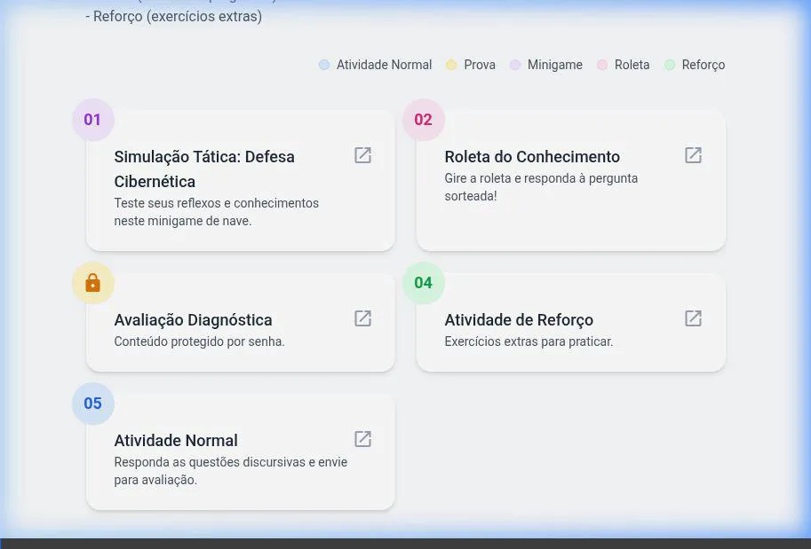
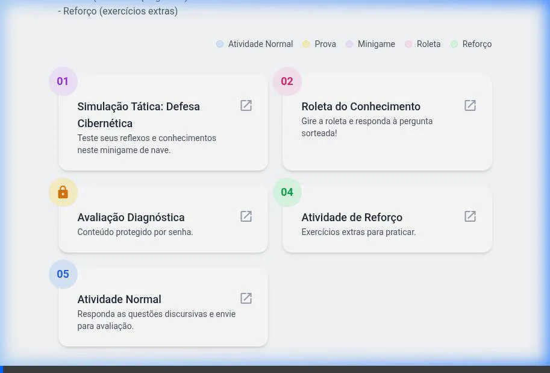
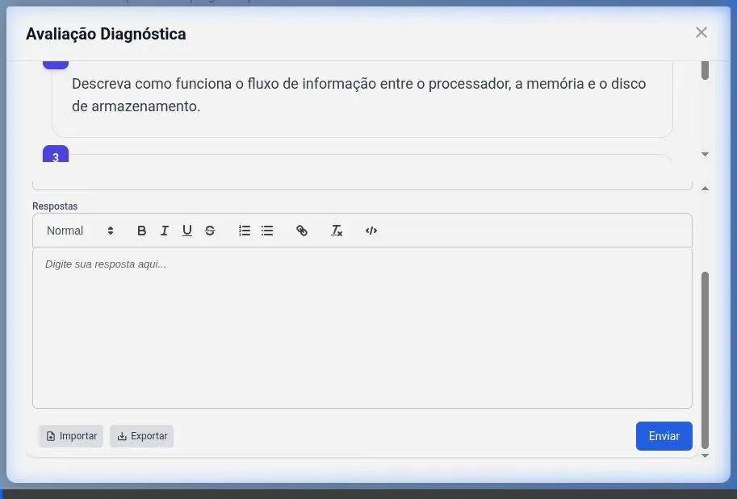
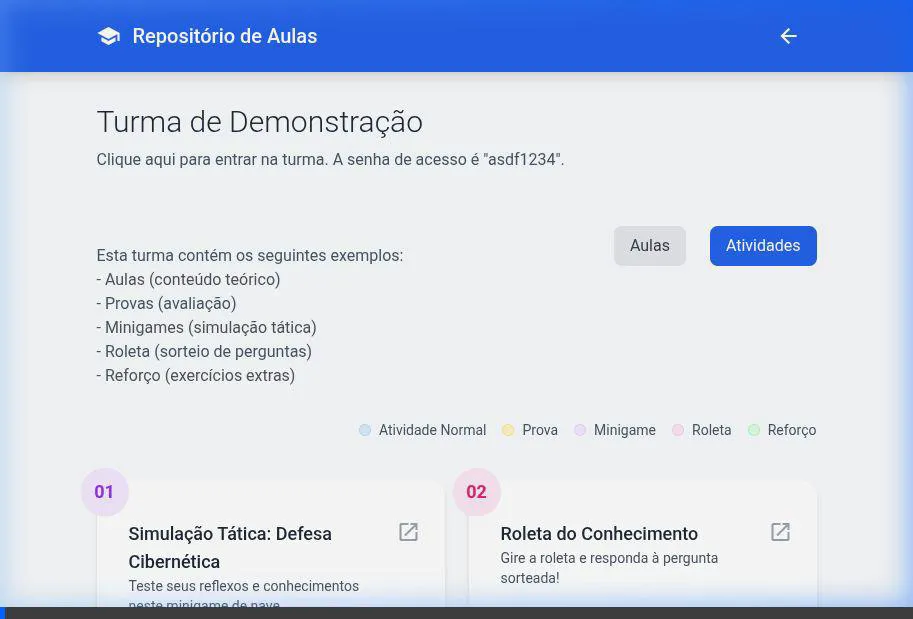
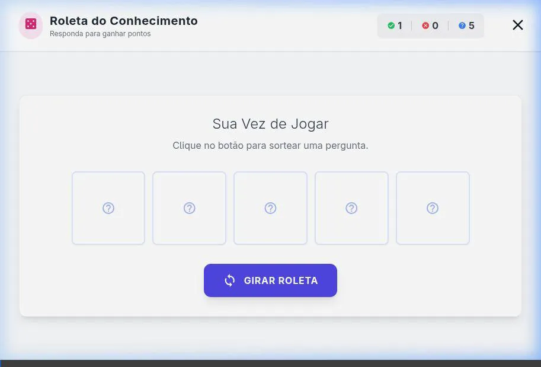

# 🎓 Repositório de Aulas
## Bem-vindo ao Sistema!
Um ambiente interativo para o seu aprendizado.

---

## 📚 Jornada de Aprendizado

O Repositório de Aulas foi construído para unificar teoria e prática, focando no desenvolvimento das suas habilidades. Cada tipo de atividade possui um propósito específico na sua jornada.

A seguir, veja como cada ferramenta pode te ajudar a evoluir e fixar o conhecimento de forma estruturada e dinâmica.

---

## 🚪 Atividade Normal (Raciocínio Profundo)

A Atividade Normal foca na **articulação de ideias**. Nela, você utiliza um editor para redigir respostas dissertativas, o que estimula o pensamento crítico, a argumentação e a estruturação lógica de conceitos complexos.

---

## 📝 Avaliação Diagnóstica (Aferição de Conhecimento)

As Provas são ambientes controlados focados na **validação do aprendizado**. Protegidas por senha, elas ajudam o professor (e você mesmo) a medir e comprovar o real entendimento do conteúdo em um momento de imersão e foco total.

---

## 🚀 Gamificação: Minigame (Reflexos e Engajamento)

O Minigame de Simulação Tática foi desenhado para testar a **agilidade mental** e a **tomada de decisão sob pressão**. Ao associar o conteúdo teórico com uma mecânica de jogo, o engajamento aumenta e a memorização ocorre com muito mais fluidez.

---

## 🎡 Roleta do Conhecimento (Micro-aprendizado)

A Roleta propõe **testes aleatórios dinâmicos**. Por meio de perguntas sorteadas, ela não apenas checa a intuição, mas explica imediatamente *o porquê* de cada alternativa estar certa ou errada através de feedbacks teóricos. Ela transforma a curiosidade (e o erro) em aprendizado.

---

## ✅ Atividade de Reforço (Fixação Rápida)

O formato ágil de Verdadeiro ou Falso é a ferramenta ideal para a **checagem rápida de fixação**. Identificadores visuais que reagem na hora aos cliques forçam o aluno a separar o que é de fato real e o que é falso na matéria recém-estudada.

---

## 🚀 Explore Você Mesmo!

Agora que você conhece os objetivos práticos de cada atividade, feche esta aba e retorne para explorar a **Turma de Demonstração**.

Aprenda no seu ritmo! ✨
