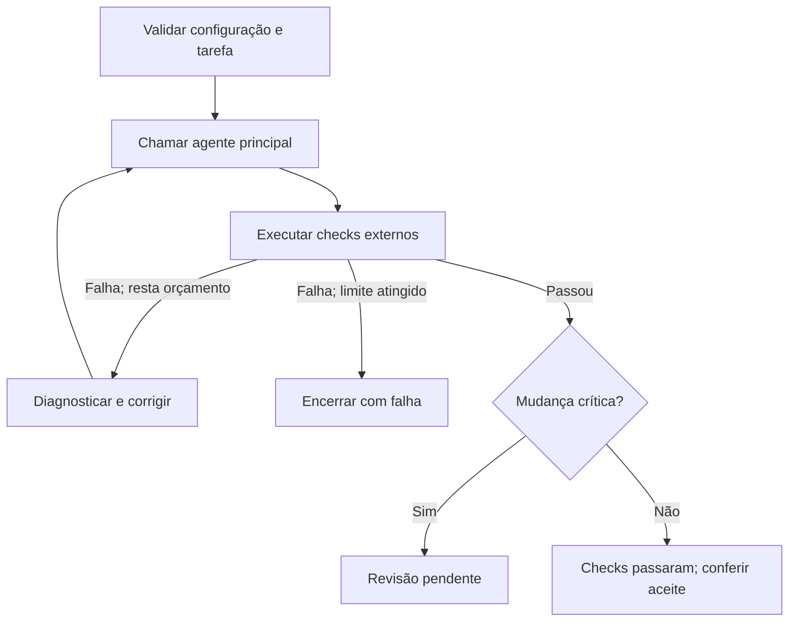

# Guia: agente com skills e orquestração enxuta, do zero

Baseado exclusivamente nas referências do relatório anterior. Consulta: 08/10/2026.

## O que você vai construir

Um fluxo de programação com **um agente principal, validação externa e skills sob demanda**. Primeiro ele funciona de maneira sequencial. Depois recebe revisão independente e, apenas onde compensar, workers em paralelo.

Não é uma reconstrução do seu arquivo de configuração anterior. Modelos, caminhos, nomes de papéis e scripts daquele arquivo não são necessários.

O runtime de exemplo é o **Pi**, porque suas referências de CLI e skills já faziam parte da pesquisa. O runner usa Python e comandos do projeto. Os princípios são transferíveis, mas os comandos abaixo são do Pi, em Linux/macOS ou outro ambiente POSIX.

**Como ler:** execute os passos 1–8 para ter o MVP. Use 9–12 para evoluí-lo. O apêndice contém o runner completo, pronto para copiar. Não carregue este guia inteiro no prompt do agente.

### O que vem das fontes e o que é decisão deste guia

| Fundamentação nas referências | Decisão de implementação aqui |
|---|---|
| Começar simples; acrescentar complexidade por necessidade [R1]. | Começar com um agente e um runner, sem framework adicional. |
| Skills carregadas progressivamente [R2, R3]. | Selecionar explicitamente as skills usadas em cada execução inicial. |
| Delegação útil para trabalho independente/contexto isolado [R4, R5]. | Adicionar primeiro reviewer; depois até dois workers para o piloto. |
| Evidência antes de conclusão [R6, R7]. | Rodar checks fora do agente e devolver estados estruturados. |
| Calibrar esforço e avaliar comportamento [R8–R10]. | Medir um modelo por vez, sem defaults universais. |

Limite de duas correções, schema, arquivos e códigos de saída são **escolhas deste tutorial**, não regras obrigatórias dos projetos citados.

## Passo 1 — Definir o resultado e a fronteira do sistema

Antes de instalar componentes, escreva cinco decisões:

1. Qual stack/projeto será atendido primeiro?
2. Qual alteração típica deve ser resolvida?
3. Qual comando demonstra seu aceite?
4. Que dados podem ser enviados ao provedor escolhido?
5. Que mudança exige revisão independente?

Para começar, escolha **um repositório sem segredos ou dados pessoais e uma alteração com teste reproduzível**. O exemplo será Python, sem dependências externas.

| Componente | Faz | Não precisa fazer no MVP |
|---|---|---|
| Principal | Busca, plano proporcional e implementação. | Criar outro agente para cada etapa. |
| Runner | Executa Pi, checks, logs, limites e estados. | Fazer julgamento arquitetural. |
| Skill | Ensina procedimento específico quando útil. | Ser um segundo sistema global de regras. |
| Reviewer, futuro | Investiga defeitos e contratos de mudança crítica. | Executar build ou modificar arquivos. |

**Aceite desta etapa:** uma tarefa exemplo tem objetivo, teste e classe de dados definidos.

## Passo 2 — Instalar e conferir o runtime

Use a instalação do README oficial do Pi [R11]. Para controlar atualizações, fixe a versão que você escolheu e revisou. Exemplo de comando; substitua a versão antes de executar:

```bash
npm install --global --ignore-scripts @earendil-works/pi-coding-agent@VERSAO_ESCOLHIDA
pi --version
pi --help
pi --list-models
```

Use a versão de Node exigida pelo README. Configure a autenticação do provedor pelo mecanismo do Pi instalado; mantenha credenciais fora dos arquivos de tarefa e dos prompts.

Selecione um par exato `provedor/id` que apareça no catálogo e faça uma chamada simples em um diretório de teste. Substitua os valores abaixo:

```bash
pi --provider PROVEDOR --model ID_EXATO --print "Responda apenas: pronto"
```

A CLI pode aceitar seleção aproximada. Confira o modelo efetivo antes de automatizar. Flags de isolamento, sessão e recursos devem existir em `pi --help` [R12].

**Aceite:** versão registrada, modelo identificado e chamada simples bem-sucedida.

## Passo 3 — Criar a estrutura mínima

Na raiz do projeto:

```bash
mkdir -p .orchestrator/runs .agents/skills
```

| Arquivo/diretório | Conteúdo |
|---|---|
| `AGENTS.md` | Regras curtas do projeto. |
| `.orchestrator/config.json` | Modelo, ferramentas, skills e limites. |
| `.orchestrator/task.json` | Pedido e checks da execução. |
| `.orchestrator/runner.py` | Código do apêndice. |
| `.orchestrator/runs/` | Logs, checkpoint e resultado por tarefa. |
| `.agents/skills/` | Skills selecionadas, depois de revisar sua origem. |

Acrescente `.orchestrator/runs/` ao `.gitignore`. Não versionar logs com dados sensíveis. Os arquivos de configuração e o runner podem ser versionados sem credenciais.

Crie `AGENTS.md`:

```markdown
# Execução

Implemente somente o escopo pedido e preserve alterações preexistentes.
Localize contratos e testes antes de editar. Planeje proporcionalmente ao risco.
Pergunte quando uma decisão bloquear o trabalho; continue o restante independente.

Buscas e mudanças pequenas ficam no principal. Delegue somente com autorização
do fluxo e benefício de independência, isolamento ou revisão.

Não enfraqueça testes ou regras para obter aprovação. Após falha, identifique
a causa antes de corrigir. Os checks finais são executados pelo runner.
Diferencie resultado observado, hipótese e informação não verificada.

Não leia nem envie segredos. Use somente a rota de dados aprovada.
Não faça commits, publicações ou ações externas sem instrução específica.
Neste MVP, não inicie navegador nem crie workers.

Entregue alteração, evidência disponível e bloqueios em poucos itens.
```

Esse texto orienta o modelo. **Ele não é uma sandbox nem uma barreira suficiente para proteger dados.** Ferramentas, permissões de sistema e política de provedor precisam ser controladas separadamente.

**Aceite:** regras curtas, sem catálogo de modelos ou documentação inteira repetida.

## Passo 4 — Configurar um modelo e checks explícitos

Crie `.orchestrator/config.json`:

```json
{
  "model": "SUBSTITUA_PROVEDOR/SUBSTITUA_ID",
  "thinking": null,
  "approved_data_classes": ["public"],
  "tools": ["read", "grep", "find", "ls", "edit", "write", "bash"],
  "skills": [],
  "deadline_seconds": 900,
  "command_timeout_seconds": 300,
  "max_repairs": 2,
  "runs_dir": ".orchestrator/runs"
}
```

Substitua o modelo pelo par validado. `thinking: null` usa o comportamento padrão do runtime/modelo; depois você pode especificar um nível suportado. Não copie a configuração de esforço de uma família para outra.

`approved_data_classes` é uma declaração **sua**, baseada na política real do provedor. Não coloque `internal` ou `sensitive` para simplesmente liberar uma tarefa. O runner verifica a declaração da tarefa, mas não descobre sozinho a sensibilidade de tudo que o agente lê.

Comece sem skills. Assim haverá uma base para comparar se uma skill melhora o resultado.

`checks` será uma lista de arrays `argv`, nunca uma string de shell. Cada comando deve ser escolhido e revisado por você. Executar sem shell evita interpolação, mas **não torna qualquer programa arbitrário seguro**.

**Aceite:** configuração sem credenciais; modelo válido; ferramentas e política de dados explícitas.

## Passo 5 — Criar uma tarefa de demonstração

Se quiser experimentar em um projeto novo, crie `app.py`:

```python
def total(values):
    return sum(values)
```

Crie `test_app.py` com a regra que o agente deverá implementar:

```python
import unittest
from app import total


class TotalTests(unittest.TestCase):
    def test_positive(self):
        self.assertEqual(total([2, 3]), 5)

    def test_negative_rejected(self):
        with self.assertRaises(ValueError):
            total([2, -1])


if __name__ == "__main__":
    unittest.main()
```

Crie `.orchestrator/task.json`, substituindo o caminho absoluto:

```json
{
  "id": "demo-001",
  "project_root": "/CAMINHO/ABSOLUTO/DO/PROJETO",
  "route": "fast",
  "critical": false,
  "data_class": "public",
  "objective": "Alterar apenas app.py para rejeitar valores negativos em total().",
  "acceptance": "Positivos continuam somados; qualquer negativo levanta ValueError. Não alterar test_app.py.",
  "checks": [["python3", "-m", "unittest", "-v", "test_app"]]
}
```

Os testes já expressam o aceite; não basta o agente declarar que corrigiu. Para um projeto real, substitua os checks por testes focados, typecheck/lint/build exigidos pela sua stack. Check ausente não vira sucesso.

**Aceite:** tarefa delimitada e teste capaz de detectar a falta da implementação.

## Passo 6 — Registrar baseline e implementar o runner

Antes do agente, execute o teste e examine o resultado:

```bash
python3 -m unittest -v test_app
```

Na demonstração, o teste de negativos **deve falhar**. Essa é a falha conhecida que a tarefa pede corrigir; não é uma surpresa de ambiente.

Em projeto real, registre também falhas preexistentes, estado do Git e comandos usados. Registre a versão inicial em um commit local ou snapshot. O runner do apêndice não executa baseline automaticamente nem separa mudanças preexistentes; esse controle é manual no MVP.

Copie o apêndice para `.orchestrator/runner.py`. Sua execução é:



**Aceite:** o runner não usa shell para montar comandos, impõe timeout, preserva o modelo e executa no máximo duas correções após a tentativa inicial.

## Passo 7 — Rodar e interpretar os estados

Da raiz do projeto:

```bash
python3 .orchestrator/runner.py .orchestrator/config.json .orchestrator/task.json
```

O runner imprime **um JSON final**, grava logs e mantém o checkpoint da tarefa. IDs usados não podem ser reexecutados automaticamente: isso evita reiniciar o orçamento após falha ou interrupção. No protótipo, recuperação é manual, após inspecionar o estado; não apague checkpoints para contornar limites.

| Estado | Exit | Interpretação |
|---|---:|---|
| `checks_passed` | 0 | Os checks configurados passaram. Confira escopo e aceite. |
| `validation_failed` | 1 | Check falhou e orçamento terminou. |
| `agent_failed` | 2 | Processo do agente falhou ou não devolveu saída. |
| `blocked` | 3 | Configuração, classe de dados, ambiente ou ID impede execução. |
| `review_required` | 4 | Checks passaram; revisão crítica ainda pendente. |
| `timeout` | 5 | Limite de tempo atingido. |
| `cancelled` | 6 | Interrupção tratada; inspecione alterações parciais. |

**Exit 0 comprova os checks, não todo requisito possível.** O texto do agente também não é prova de sucesso. Na demonstração, confirme que `test_app.py` não foi alterado e que os dois comportamentos passam.

Falha de provedor não troca de modelo automaticamente. Escolha um substituto compatível com os dados, ou retome posteriormente por um procedimento explícito. Não use fallback para contornar recusas de salvaguarda.

**Aceite:** a demonstração corrige `app.py`; os testes passam; o diff preserva o escopo.

## Passo 8 — Validar o controle antes de ampliar

Teste estes cenários no seu ambiente:

| Teste | Resultado esperado |
|---|---|
| Implementação correta | `checks_passed`, exit 0. |
| Check falha continuamente | Até duas correções; `validation_failed`. |
| Processo Pi falha | `agent_failed`; sem fallback silencioso. |
| Lista de checks vazia | `blocked`; agente nem inicia. |
| Tarefa sem classe de dados aprovada | `blocked`; agente nem inicia. |
| Tarefa crítica | `review_required`, mesmo com testes passando. |
| Mesmo ID usado outra vez | `blocked`, checkpoint preservado. |
| Timeout/cancelamento | Estado explícito e encerramento do grupo de processos POSIX. |

O runner incluído foi testado aqui com **Pi simulado**, incluindo sucesso, revisão pendente, esgotamento de correções, falha de processo, bloqueio de dados/checks, timeout, ID repetido e limite inválido. Isso valida o controle do exemplo; integração com seu Pi e qualidade de modelos devem ser verificadas na sua instalação.

Nesse ponto você já tem o MVP. Não acrescente cinco agentes para fazê-lo parecer completo.

## Passo 9 — Adicionar uma skill e comparar

Escolha primeiro `systematic-debugging` ou use `verification-before-completion` como referência para os gates [R6, R7]. Não instale a metodologia Superpowers inteira sem medir seu overhead [R13].

Procedimento:

1. Abra o `SKILL.md` oficial e todas as referências/scripts que ele aciona.
2. Escolha um commit/tag revisado; registre origem, versão e licença.
3. Copie a pasta completa da skill para `.agents/skills/`, preservando arquivos necessários.
4. Acrescente o **caminho absoluto da pasta** ao array `skills` da configuração.
5. Execute uma tarefa nova, com novo ID, e compare com a versão sem skill.
6. Retire a skill se adicionar chamadas, relatórios ou ciclos sem benefício de qualidade.

O runner desativa descoberta automática de skills e carrega as explicitamente selecionadas. Em uso interativo, o Pi oferece `/skill:nome`; para uso mais dinâmico, pode-se deixar um catálogo pequeno disponível ao principal [R3].

Se criar uma skill própria, use frontmatter `name`/`description`, corpo operacional curto e referências separadas. A descrição define quando aplicar; evite gatilho vago como “usar em qualquer tarefa”. O padrão de carregamento progressivo evita inserir todas as instruções desde o início [R2].

Use `skill-creator` da Anthropic como referência para avaliar casos com/sem skill e gatilhos positivos/negativos [R14]. React/Next.js pode receber `react-best-practices` de Vercel quando essa for a stack [R15].

**Aceite:** skill ativa na tarefa certa e melhora algum critério sem degradar os demais.

## Passo 10 — Adicionar revisão independente

A próxima extensão deve ser um **reviewer de leitura**, acionado nas mudanças críticas ou contratos compartilhados. O MVP apenas sinaliza `review_required`; não executa essa etapa automaticamente.

Prepare um pacote contendo objetivo, aceite, baseline, arquivos alterados, diff completo, arquivos novos e checks executados. Não corte as primeiras N linhas e declare review completo. Indique cobertura e pendências.

Em workspace compartilhado, remova `bash`, `edit` e `write` do reviewer. Desative extensões/MCP não necessários. Essas restrições de ferramentas reduzem alcance, mas não substituem permissões de sistema [R12].

Crie `.orchestrator/review_packet.md` com esse pacote e execute uma sessão separada. Substitua modelo/provedor; a pasta de logs da tarefa já deve existir:

```bash
pi --provider PROVEDOR_REVIEW --model ID_EXATO_REVIEW --print \
  --session-id demo-001-review --tools read,grep,find,ls \
  --no-extensions --no-mcp --no-skills -- \
  @.orchestrator/review_packet.md \
  "Revise o pacote e o código. Não implemente. Aponte defeitos com evidência e declare a cobertura." \
  > .orchestrator/runs/demo-001/review.log
```

No MVP, leia o review e decida o aceite manualmente. Não edite `result.json` para fazer a etapa parecer automatizada; registre a decisão de revisão separadamente, com arquivos, resultado e evidência.

Contrato de revisão proposto:

```json
{
  "review_status": "needs_changes",
  "coverage": "complete",
  "reviewed_files": ["src/example.py"],
  "findings": [
    {
      "severity": "high",
      "file": "src/example.py",
      "location": "funcao_exemplo",
      "evidence": "Caminho que viola o contrato informado.",
      "recommendation": "Preservar a verificação antes da operação."
    }
  ]
}
```

É um schema do tutorial. Use saída estruturada quando o adapter a suportar; caso contrário valide o JSON e bloqueie em formato/cobertura incompletos [R16]. JSON válido não garante que o review seja correto.

Se houver correção, ela compartilha o orçamento da tarefa. Rode os checks novamente e revise os trechos alterados. Não declare tarefa crítica aceita enquanto houver achado bloqueante ou cobertura pendente.

**Aceite:** reviewer encontra um defeito crítico plantado em uma tarefa de avaliação e não modifica o projeto.

## Passo 11 — Introduzir orquestração somente onde compensar

Para trabalhos grandes, acrescente uma ferramenta de dispatch ou um scheduler. Não é necessário criar uma nova aplicação inteira: o runner pode continuar responsável pelos processos/checks e o principal pela divisão do trabalho [R1, R5].

Contrato mínimo para worker:

```json
{
  "task_id": "feature-021-part-a",
  "role": "implement",
  "objective": "Implementar uma unidade independente.",
  "read_scope": ["src/contracts.py", "src/module_a.py"],
  "write_scope": ["src/module_a.py"],
  "depends_on": [],
  "acceptance": "Comportamento observável e verificável.",
  "checks": [["python3", "-m", "unittest", "test_module_a"]],
  "may_delegate": false
}
```

Esses campos são uma proposta: **o runner do apêndice não aplica `write_scope`, dependências ou dispatch**. Para aplicá-los, acrescente isolamento/permissões e validação de diff no scheduler.

Evolução incremental:

1. Comece com workers sequenciais, sessões separadas e contratos pequenos.
2. Delegue apenas uma investigação extensa ou implementação independente.
3. Verifique integração e logs antes de acrescentar concorrência.
4. Faça piloto com até dois workers simultâneos e uma camada de delegação.
5. Use worktree/ambiente separado por writer; integre resultados no principal.
6. Controle também banco, portas, lockfiles, geração de código e recursos de teste. Arquivos diferentes não garantem independência.
7. Faça gate integrado e review necessário ao fim.

Use a skill `dispatching-parallel-agents` como referência para independência [R17]. A metodologia `subagent-driven-development` é outra opção para trabalhos extensos, mas cria contextos/revisões e ciclos próprios: avalie antes de adotar integralmente [R18].

**Aceite:** delegação reduz tempo até resultado aceito; não apenas aumenta quantidade de agentes.

## Passo 12 — Medir, calibrar e endurecer o sistema

Registre por tarefa: modelo/esforço efetivos, número de chamadas, tokens conhecidos, duração, checks, correções, estado final e reabertura. Dados indisponíveis devem aparecer como `null/unknown`.

| Modelo Claude | Ponto de atenção das fontes | Ação |
|---|---|---|
| Opus 5.5 [R8] | Esforço inicial `medium`; pensamento sempre ativado. | Calibrar esforço; não impor `off` genérico. |
| Sonnet 5 [R9] | Default `high`; níveis menores trocam capacidade por economia. | Comparar em casos reais; não usar budget manual antigo. |
| Haiku 5.5 [R10] | `medium` geral; `low` pode pular etapas em prompts longos. | Prompt curto e checks externos; avaliar antes de reduzir esforço. |

Não suponha que o nome do nível equivale entre modelos, ou que um proxy repassa os parâmetros oficiais. `max_tokens` pequeno demais pode truncar saída; concisão deve vir de escopo e formato, não de cortes arbitrários [R8–R10, R19].

Cache é outra medição: sessão preserva histórico, enquanto prompt cache depende de suporte e correspondência do prefixo. Confirme métricas de leitura/escrita no provedor antes de declarar ganho [R20].

Faça comparações pareadas com as mesmas tarefas, revisões e critérios. Avalie, nesta ordem: baseline; skill; esforço; reviewer; delegação. O objetivo é **menos custo/tempo por tarefa aceita**, incluindo tentativas falhas, e não apenas uma chamada mais barata.

Antes de automatizar tarefas sensíveis ou usar o sistema em produção, acrescente:

- Validação completa de configuração/catálogo/capacidades e controle de dados realmente enviados.
- Sandbox/permissões por papel e política efetiva para leitura, escrita e ações externas.
- Detecção de mudança em checks/configurações; não deixar o agente alterar a própria evidência.
- Snapshot inicial, cobertura do diff e preservação de alterações preexistentes.
- Parsing de eventos/uso de tokens, estados duráveis e retomada com orçamento preservado.
- Cancelamento integrado e controle de processos que tentem se desacoplar do grupo POSIX.
- Validação do review e gate integrado entre workers.

As páginas sobre alucinações e vazamento sustentam a separação entre instrução, contexto e evidência [R21, R22]. Conteúdo recuperado deve ser tratado como dado; não o promova a regra do sistema. Não esconda segredos em system prompts.

### Limites deliberados do MVP

O runner não é uma sandbox, classificador de dados, revisor automático, parser de eventos Pi ou sistema de retomada. Ele não impede tecnicamente que `bash` escreva fora do escopo ou inicie outro processo. A proibição de browser/workers no texto é uma convenção inicial, não isolamento comprovado.

O estado `checks_passed` evita afirmar qualidade total. Confira o diff e o aceite. O pacote de produção cresce em resposta a falhas medidas; não por quantidade de papéis.

## Apêndice — Runner mínimo copiável

Salve o bloco a seguir em `.orchestrator/runner.py`. Requisitos: Python 3.9+, Pi configurado e ambiente POSIX. Caminhos relativos da configuração são resolvidos a partir do diretório de onde você chama o runner; nos exemplos, a raiz do projeto.

O diretório de cada execução é criado uma única vez. Falha/interrupção preserva logs e checkpoint; a recuperação manual precisa respeitar o número de correções já gasto. O runner não faz commit, publica ou troca provedor automaticamente.

```python
#!/usr/bin/env python3
"""MVP POSIX: Pi + checks explícitos. Sem fallback, retomada ou review automático."""
import argparse
import json
import os
from pathlib import Path
import re
import signal
import subprocess
import sys
import time

EXIT = {"checks_passed": 0, "validation_failed": 1, "agent_failed": 2,
        "blocked": 3, "review_required": 4, "timeout": 5, "cancelled": 6}


def read_json(path):
    return json.loads(Path(path).read_text(encoding="utf-8"))


def run_logged(argv, cwd, path, timeout):
    """Não usa shell; encerra grupo POSIX se houver timeout/cancelamento."""
    if timeout <= 0:
        raise subprocess.TimeoutExpired(argv, timeout)
    with path.open("w", encoding="utf-8") as log:
        proc = subprocess.Popen(argv, cwd=cwd, stdin=subprocess.DEVNULL,
                                stdout=log, stderr=subprocess.STDOUT,
                                start_new_session=True)
        try:
            return proc.wait(timeout=timeout)
        except BaseException:
            try:
                os.killpg(proc.pid, signal.SIGTERM)
            except ProcessLookupError:
                pass
            try:
                proc.wait(timeout=2)
            except subprocess.TimeoutExpired:
                pass
            try:
                os.killpg(proc.pid, signal.SIGKILL)
            except ProcessLookupError:
                pass
            proc.wait()
            raise


def main():
    parser = argparse.ArgumentParser()
    parser.add_argument("config")
    parser.add_argument("task")
    args = parser.parse_args()
    state, run_dir, started = {}, None, None
    def cancel(*_):
        raise KeyboardInterrupt

    signal.signal(signal.SIGTERM, cancel)

    def persist(result):
        if run_dir is not None:
            temp = run_dir / "result.tmp"
            temp.write_text(json.dumps(result, ensure_ascii=False, indent=2),
                            encoding="utf-8")
            temp.replace(run_dir / "result.json")
    def finish(status, message):
        if started is not None:
            state["wall_time_seconds"] = round(time.monotonic() - started, 3)
        result = {**state, "status": status, "message": message}
        persist(result)
        print(json.dumps(result, ensure_ascii=False))
        return EXIT[status]

    try:
        config, task = read_json(args.config), read_json(args.task)
        task_id = task["id"]
        if not isinstance(task_id, str) or not re.fullmatch(
                r"[A-Za-z0-9](?:[A-Za-z0-9_-]{0,62}[A-Za-z0-9])?", task_id):
            raise ValueError("ID inválido")
        root = Path(task["project_root"]).resolve(strict=True)
        if not root.is_dir():
            raise ValueError("project_root deve ser diretório")
        approved = config["approved_data_classes"]
        if not isinstance(approved, list) or not approved or any(
                c not in {"public", "internal", "sensitive"} for c in approved):
            raise ValueError("approved_data_classes inválido")
        if task.get("data_class", "unknown") not in approved:
            return finish("blocked", "Classe de dados sem rota aprovada")
        if task.get("route") not in ("fast", "full"):
            raise ValueError("route deve ser fast ou full")
        if not isinstance(task.get("critical"), bool):
            raise ValueError("critical deve ser booleano")
        for field in ("objective", "acceptance"):
            if not isinstance(task.get(field), str) or not task[field].strip():
                raise ValueError(f"{field} obrigatório")
        checks = task["checks"]
        if not isinstance(checks, list) or not checks or any(
            not isinstance(a, list) or not a or any(
                not isinstance(v, str) or not v for v in a) for a in checks):
            raise ValueError("checks deve conter arrays argv não vazios")
        model = config["model"]
        provider, model_id = model.split("/", 1)
        if not provider or not model_id or "SUBSTITUA" in model:
            raise ValueError("Configure o modelo exato disponível no Pi")
        budget = float(config["deadline_seconds"])
        command_timeout = float(config["command_timeout_seconds"])
        if budget <= 0 or command_timeout <= 0:
            raise ValueError("Timeouts devem ser positivos")
        max_repairs = config["max_repairs"]
        if type(max_repairs) is not int or not 0 <= max_repairs <= 2:
            raise ValueError("max_repairs deve estar entre 0 e 2")
        tools = config["tools"]
        if not isinstance(tools, list) or not tools or any(
                t not in {"read", "grep", "find", "ls", "edit", "write", "bash"}
                for t in tools):
            raise ValueError("Allowlist de ferramentas inválida")
        skill_paths = [Path(p).resolve(strict=True) for p in config.get("skills", [])]
        base = Path(config["runs_dir"]).resolve()
        base.mkdir(parents=True, exist_ok=True)
        candidate = base / task_id
        try:
            candidate.mkdir(mode=0o700)
        except FileExistsError:
            return finish("blocked", "ID já executado; inspecione o checkpoint")
        run_dir = candidate
        started = time.monotonic()
        state.update(task_id=task_id, model=model, route=task["route"],
                     session_id=f"{task_id}-main", repair_attempts=0, checks=[])
        (run_dir / "task.json").write_text(json.dumps(task, ensure_ascii=False),
                                           encoding="utf-8")
        persist({**state, "status": "running"})

        def remaining():
            return min(command_timeout, budget - (time.monotonic() - started))

        prompt = (f"Objetivo: {task['objective']}\nAceite: {task['acceptance']}\n"
                  f"Rota: {task['route']}; planeje proporcionalmente.\n"
                  "Trabalhe apenas neste escopo. Não delegue. Preserve regras do projeto.\n"
                  "Não enfraqueça checks nem inicie navegador. Reporte bloqueios.\n"
                  "Os checks finais são executados pelo runner; não afirme seus resultados.")
        for attempt in range(max_repairs + 1):
            state["repair_attempts"] = attempt
            persist({**state, "status": "running"})
            argv = ["pi", "--provider", provider, "--model", model_id, "--print",
                    "--session-id", state["session_id"], "--tools", ",".join(tools),
                    "--no-extensions", "--no-mcp", "--no-skills", "--no-prompt-templates"]
            if config.get("thinking") is not None:
                argv.extend(["--thinking", config["thinking"]])
            for path in skill_paths:
                argv.extend(["--skill", str(path)])
            # stdin está fechado; o prompt é argumento, nunca código shell.
            argv.extend(["--", prompt])
            agent_log = run_dir / f"agent-{attempt}.log"
            code = run_logged(argv, root, agent_log, remaining())
            if code != 0 or agent_log.stat().st_size == 0:
                return finish("agent_failed", f"Inspecione {agent_log.name}; sem fallback")
            state["checks"] = []
            failed = None
            for number, check in enumerate(checks):
                log = run_dir / f"check-{attempt}-{number}.log"
                code = run_logged(check, root, log, remaining())
                record = {"argv": check, "exit_code": code, "log": str(log)}
                state["checks"].append(record)
                if code != 0:
                    failed = record
                    break
            if failed is None:
                status = "review_required" if task["critical"] else "checks_passed"
                return finish(status, "Checks configurados passaram; confira o aceite e o diff")
            if attempt == max_repairs:
                return finish("validation_failed", "Limite de reparos atingido")
            # Sem truncar erro arbitrariamente: o agente lê o log relevante sob demanda.
            prompt = (f"Reparo {attempt + 1}/{max_repairs}, mesma tarefa.\n"
                      f"Objetivo: {task['objective']}\nAceite: {task['acceptance']}\n"
                      f"Check falhou: {json.dumps(failed['argv'])}\n"
                      f"Leia o diagnóstico em {failed['log']}. Identifique a causa antes de editar.\n"
                      "Não enfraqueça checks, não delegue e preserve o escopo.")
    except subprocess.TimeoutExpired:
        return finish("timeout", "Deadline/timeout atingido; inspecione logs e diff")
    except KeyboardInterrupt:
        return finish("cancelled", "Execução cancelada; inspecione logs e diff")
    except (OSError, ValueError, KeyError, TypeError) as error:
        return finish("blocked", f"Configuração/ambiente bloqueado: {error}")


if __name__ == "__main__":
    raise SystemExit(main())
```

## Referências utilizadas

Somente fontes já presentes no relatório anterior. As recomendações de arquitetura e o código são uma implementação didática minha, não software distribuído por esses autores.

| ID | Referência |
|---|---|
| R1 | [Building effective agents — Anthropic](https://www.anthropic.com/engineering/building-effective-agents) |
| R2 | [Agent Skills specification](https://agentskills.io/specification) |
| R3 | [Pi Skills](https://github.com/earendil-works/pi/blob/main/packages/coding-agent/docs/skills.md) |
| R4 | [Claude prompting best practices](https://platform.claude.com/docs/pt-BR/build-with-claude/prompt-engineering/claude-prompting-best-practices) |
| R5 | [Multi-agent research system — Anthropic](https://www.anthropic.com/engineering/multi-agent-research-system) |
| R6 | [Systematic debugging — Superpowers](https://github.com/obra/superpowers/blob/main/skills/systematic-debugging/SKILL.md) |
| R7 | [Verification before completion — Superpowers](https://github.com/obra/superpowers/blob/main/skills/verification-before-completion/SKILL.md) |
| R8 | [Prompting Opus 5.5](https://platform.claude.com/docs/pt-BR/build-with-claude/prompt-engineering/prompting-claude-opus-5-5) |
| R9 | [Prompting Sonnet 5](https://platform.claude.com/docs/pt-BR/build-with-claude/prompt-engineering/prompting-claude-sonnet-5) |
| R10 | [Prompting Haiku 5.5](https://platform.claude.com/docs/pt-BR/build-with-claude/prompt-engineering/prompting-claude-haiku-5-5) |
| R11 | [Pi README](https://github.com/earendil-works/pi/blob/main/packages/coding-agent/README.md) |
| R12 | [Pi CLI](https://github.com/earendil-works/pi/blob/main/packages/coding-agent/docs/cli.md) |
| R13 | [Superpowers — repositório](https://github.com/obra/superpowers) |
| R14 | [Skill creator — Anthropic](https://github.com/anthropics/skills/blob/main/skills/skill-creator/SKILL.md) |
| R15 | [React best practices — Vercel](https://github.com/vercel-labs/agent-skills/blob/main/skills/react-best-practices/SKILL.md) |
| R16 | [Increase consistency](https://platform.claude.com/docs/pt-BR/test-and-evaluate/strengthen-guardrails/increase-consistency) |
| R17 | [Dispatching parallel agents — Superpowers](https://github.com/obra/superpowers/blob/main/skills/dispatching-parallel-agents/SKILL.md) |
| R18 | [Subagent driven development — Superpowers](https://github.com/obra/superpowers/blob/main/skills/subagent-driven-development/SKILL.md) |
| R19 | [Reduce latency](https://platform.claude.com/docs/pt-BR/test-and-evaluate/strengthen-guardrails/reduce-latency) |
| R20 | [Prompt caching](https://platform.claude.com/docs/en/build-with-claude/prompt-caching) |
| R21 | [Reduce hallucinations](https://platform.claude.com/docs/pt-BR/test-and-evaluate/strengthen-guardrails/reduce-hallucinations) |
| R22 | [Reduce prompt leak](https://platform.claude.com/docs/pt-BR/test-and-evaluate/strengthen-guardrails/reduce-prompt-leak) |

A página Haiku foi consultada na pesquisa anterior; a tentativa de reabertura nesta etapa retornou erro. As orientações dessa linha foram mantidas a partir da consulta anterior, sem inferir mudança ou indisponibilidade do modelo.
